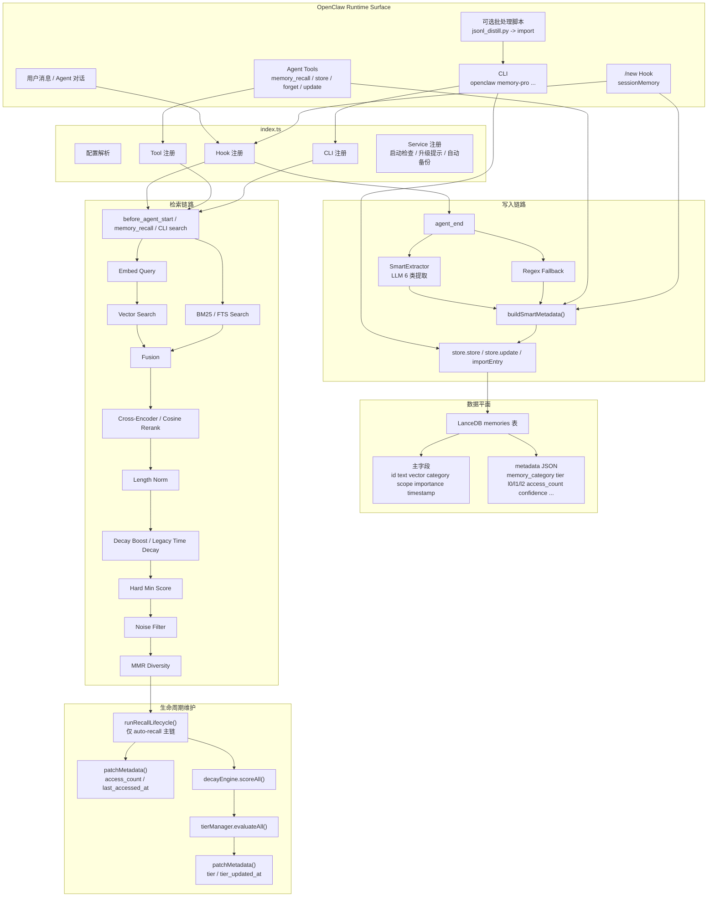
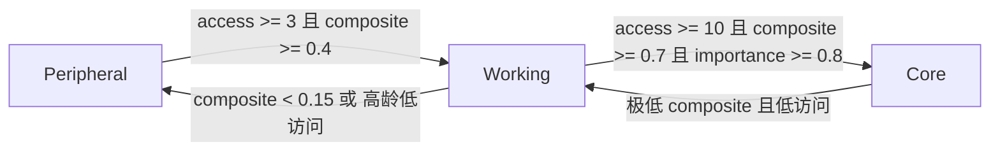

# `memory-lancedb-pro` 记忆架构分析

> 更新时间：2026-03-06  
> 基准：当前仓库中的 `README.md`、`openclaw.plugin.json`、`index.ts`、`src/*`、`cli.ts`  
> 结论：当前版本已经形成完整的“写入 -> 存储 -> 检索 -> 生命周期维护 -> 运维工具”闭环；智能提取、生命周期衰减、Tier 晋升/降级、迁移升级、CLI 与 Agent Tools 都已纳入同一主架构。

---

## 一、架构判断摘要

### 1.1 当前真实主路径

当前版本不是“在旧向量记忆插件上补了几个实验模块”，而是一个完整的 OpenClaw Memory Plugin：

- `index.ts` 负责插件注册、配置解析、Hook 装配、CLI 装配、后台服务装配
- `src/store.ts` 负责 LanceDB 表初始化、CRUD、向量检索、FTS/BM25、metadata 局部回写
- `src/embedder.ts` 负责统一 Embedding Provider 适配、任务感知 embedding、长文本 chunking、缓存
- `src/retriever.ts` 负责混合检索、rerank、长度归一化、生命周期重排、噪声过滤、去重多样性
- `src/smart-extractor.ts` 负责 LLM 智能提取、两阶段去重、语义合并、新格式写入
- `src/decay-engine.ts` + `src/tier-manager.ts` 负责 recall 后的生命周期评分与 tier 演化
- `src/tools.ts` 和 `cli.ts` 分别提供 Agent Tool 面与运维 CLI 面

### 1.2 当前版本最重要的架构特征

- 智能提取已经进入默认写入主路径，regex 仅作为兜底
- 生命周期衰减已经进入默认检索主路径，不再是“代码里有对象但没接上”
- smart metadata 已成为全系统的统一中间层
- 旧 5 类 store category 与新 6 类 memory category 处于“双层兼容模型”
- auto-recall、tool recall、CLI、迁移、升级、session memory 都共享同一份 LanceDB 数据平面

### 1.3 仍保留的兼容层

- 无 FTS 时自动回退到 vector-only / lexical fallback
- 无 lifecycle decay 时回退到旧的 `recency boost + importance weight + time decay`
- legacy memory 仍能读；可通过 `memory-pro upgrade` 补齐 smart metadata
- 存储表 schema 未拆分成多张新表，而是保留单表 + `metadata` JSON 扩展

---

## 二、总体架构图



---

## 三、入口层：`index.ts` 是总装配器

`index.ts` 不是简单导出插件对象，而是整个系统的总装配器，负责把各模块接入 OpenClaw：

- 解析配置并做 env var 展开
- 创建 `MemoryStore`、`Embedder`、`MemoryRetriever`、`ScopeManager`
- 可选初始化 `SmartExtractor`
- 注册 Agent Tools
- 注册 `memory-pro` CLI
- 注册 `before_agent_start`、`agent_end`、`command:new`
- 注册后台 service：启动检查、legacy upgrade 提示、自动备份

### 3.1 运行时默认值

按当前实现，关键默认行为如下：

- `smartExtraction`: 默认开启
- `extractMinMessages`: 默认 `2`
- `autoCapture`: 默认开启
- `autoRecall`: 默认关闭
- `captureAssistant`: 默认关闭
- `enableManagementTools`: 默认关闭
- `sessionMemory`: 只有显式 `sessionMemory.enabled === true` 才注册 Hook，运行时默认关闭

### 3.2 服务层职责

插件 `registerService().start()` 不是业务核心链路，但它负责运维闭环：

- 异步执行 `embedder.test()` 与 `retriever.test()`，避免阻塞 Gateway 启动
- 启动后约 5 秒检查 legacy memory 数量并输出 upgrade 提示
- 启动后 1 分钟做一次 JSONL 备份，此后每 24 小时做一次
- 停止时清理定时器

这意味着该插件不仅有“读写能力”，也有“自检 + 自提示 + 备份”的运维能力。

---

## 四、写入架构：从对话到长期记忆

### 4.1 写入入口清单

当前写入来源不止一条：

- `agent_end` 自动捕获
- `memory_store` Agent Tool 手工写入
- `memory_update` Agent Tool 原地更新
- `command:new` 的 session summary 写入
- `memory-pro import`
- `memory-pro migrate run`
- `memory-pro upgrade`
- `memory-pro reembed`

其中自动捕获是最核心的在线写入链路。

### 4.2 `agent_end` 写入主路径

`agent_end` 的执行顺序是：

```text
抽取文本（默认仅 `user`；当 `captureAssistant === true` 时也包含 `assistant`）
  -> 若 smartExtractor 可用且消息数达阈值:
       SmartExtractor.extractAndPersist()
       若 created > 0 或 merged > 0，则直接 return
       否则继续走 regex fallback
  -> shouldCapture() + detectCategory() + regex fallback
  -> buildSmartMetadata()
  -> store.store()
```

几个关键点：

- 智能提取只有在产出持久化结果时，才会接管整个自动捕获路径
- regex fallback 仍存在，但已经不再输出“半旧格式数据”
- fallback 写入前仍做噪声过滤与重复检查
- 每轮对话最多写入 3 条 fallback memory
- 在 OpenClaw 实际运行中，`agent_end.event.messages` 的粒度取决于上游 Hook payload；当前插件不会主动回读会话历史，而是直接消费该事件携带的消息数组

### 4.3 SmartExtractor 主链

`src/smart-extractor.ts` 的核心流程是：

```text
conversationText
  -> LLM 抽取 CandidateMemory[]
  -> 逐条向量预筛
  -> LLM 判定 CREATE / MERGE / SKIP
  -> buildSmartMetadata()
  -> store.store() / store.update()
```

当前特征：

- 候选记忆最多处理 5 条
- 第一阶段去重使用 `vectorSearch(..., threshold=0.7)`
- 第二阶段去重交给 LLM 做语义决策
- `profile` 类记忆永远优先走 merge
- `events` / `cases` 更偏 append-only

### 4.4 6 类智能分类与 5 类存储分类并存

这是当前架构最重要的兼容设计之一。

### 智能分类

定义在 `src/memory-categories.ts`：

- `profile`
- `preferences`
- `entities`
- `events`
- `cases`
- `patterns`

### 存储分类

底层 LanceDB 主字段 `category` 仍保留旧 5 类：

- `preference`
- `fact`
- `decision`
- `entity`
- `other`

### 映射关系

`SmartExtractor` 写入时会做兼容映射：

| 智能分类 | 存储分类 |
| --- | --- |
| `profile` | `fact` |
| `preferences` | `preference` |
| `entities` | `entity` |
| `events` | `decision` |
| `cases` | `fact` |
| `patterns` | `other` |

因此：

- 结构化语义分类保存在 `metadata.memory_category`
- 向后兼容的粗粒度分类保存在 `entry.category`

也正因为如此，CLI / Tool 里的 `category` 过滤目前仍以旧 5 类为准。

### 4.5 `memory_update` 的定位

`memory_update` 是新版里值得单独强调的能力：

- 支持按完整 UUID 或 8+ 前缀定位 memory
- 文本更新时自动重新 embedding
- 保留原始 `timestamp`
- 适合修正陈旧事实，而不是“删旧建新”

这意味着系统现在支持“记忆更正”而不只是“记忆追加”。

---

## 五、统一元数据层：`smart-metadata.ts` 是系统中枢

`src/smart-metadata.ts` 是整套架构的真正收敛点。

它负责：

- 解析 legacy metadata
- 用 entry 本身补齐缺省字段
- 将新旧 memory 归一化成统一 metadata 结构
- 将 entry 转换为 lifecycle scoring 所需的 `LifecycleMemory`

### 5.1 当前 metadata 常见字段

| 字段 | 含义 |
| --- | --- |
| `memory_category` | 新 6 类语义分类 |
| `tier` | `core` / `working` / `peripheral` |
| `l0_abstract` | 短句索引，默认也是主搜索文本 |
| `l1_overview` | 结构化摘要 |
| `l2_content` | 长叙述内容 |
| `access_count` | 被 recall 的次数 |
| `confidence` | 抽取/合并置信度 |
| `last_accessed_at` | 最近被 recall 时间 |
| `source_session` | 来源 session key |
| `type` | 特殊类型，如 `session-summary` |
| `tier_updated_at` | tier 最近更新时间 |
| `migratedFrom` / `originalId` | 迁移/升级来源信息 |

### 5.2 为什么 metadata 是核心设计

当前实现没有把 L0/L1/L2、tier、access_count 单独提升为 LanceDB 表字段，而是统一放进 `metadata` JSON。这样做带来四个结果：

- 不需要重建 LanceDB 主表
- legacy entry 能平滑升级
- store 层的 CRUD 复杂度保持可控
- lifecycle、smart extraction、迁移、session memory 可以共享同一格式

---

## 六、存储层：`MemoryStore` 不只是 CRUD

`src/store.ts` 的职责比 README 表里写的更重。

### 6.1 初始化阶段

`MemoryStore` 是 lazy-init 的：

- 首次访问时连接 LanceDB
- 若表不存在则创建 `memories`
- 创建或检测 FTS index
- 校验 vector dimension 是否匹配

因此 store 既是数据库访问层，也是 schema 守门层。

### 6.2 查询能力

它提供三种检索能力：

- `vectorSearch()`
- `bm25Search()`
- `lexicalFallbackSearch()`

其中 BM25 路径是：

```text
有 FTS index -> LanceDB search(query, "fts")
无 FTS / FTS 失败 -> lexicalFallbackSearch()
```

lexical fallback 不只匹配 `entry.text`，还会参考：

- `l0_abstract`
- `l1_overview`
- `l2_content`

这意味着即使 FTS 不可用，smart metadata 仍然参与词法命中。

### 6.3 更新能力

当前 LanceDB 不支持真正的 in-place update，所以 `store.update()` 采用：

```text
读旧行 -> 构造新 entry -> delete old -> add new
```

而 `patchMetadata()` 则是在这层之上封装的 metadata 局部更新入口，被以下链路复用：

- recall 访问计数更新
- tier 回写
- 未来的 lifecycle 扩展字段更新

### 6.4 运维相关能力

store 层还承接了多项运维需求：

- `delete()` 支持 UUID 与前缀删除
- `bulkDelete()` 强制要求 filter，避免误删全库
- `importEntry()` 保留源 `id/timestamp`，用于 reembed / migration
- `stats()` 为 CLI 和管理工具提供聚合统计
- `hasId()` 用于过滤 BM25 ghost entry

---

## 七、Embedding 层：Provider 适配 + Chunking + Cache

`src/embedder.ts` 在当前架构里不是简单的 OpenAI SDK 包装，而是完整的 embedding 抽象层。

### 7.1 主要能力

- OpenAI-compatible provider 统一接入
- `taskQuery` / `taskPassage` 任务感知 embedding
- `dimensions` 透传
- `normalized` 透传
- LRU + TTL embedding cache
- 长文本自动 chunking

### 7.2 长文本 chunking 的角色

`src/chunker.ts` 为 embedding 超长文本提供模型感知分块：

- 超过上下文限制时触发
- 按语义边界切块并带 overlap
- 分块 embedding 后做平均向量聚合

这条能力对以下场景尤其重要：

- session summary
- 导入的长文档 memory
- reembed/import 场景

从实现上看，embedder 当前默认开启 auto-chunking。

---

## 八、检索架构：混合检索已经是默认主线

`src/retriever.ts` 是当前系统的在线 recall 核心。

### 8.1 检索入口

当前有三类读取入口共用 retriever：

- `before_agent_start` 自动召回
- `memory_recall` Agent Tool
- `memory-pro search` CLI

### 8.2 混合检索主链

在有 FTS 支持时，默认路径是：

```text
embedQuery(query)
  -> vectorSearch
  -> bm25Search
  -> fusion
  -> rerank
  -> length normalization
  -> hard min score
  -> lifecycle decay boost / legacy time decay
  -> noise filter
  -> MMR diversity
```

更具体地说：

1. 向量检索和 BM25 并行执行  
2. `fuseResults()` 以向量分数为主，BM25 命中提供确认性加权  
3. 可选 Cross-Encoder rerank，失败则降级为 cosine rerank  
4. 长文本进行长度惩罚  
5. 过低语义相关度结果直接硬过滤  
6. 生命周期分数再做最终重排  
7. 去噪与近重复打散

### 8.3 当前融合策略不是教科书式 RRF

README 把它描述为 hybrid fusion，但代码中的实际策略更偏“向量分数主导 + BM25 奖励”：

- 命中向量时，以向量分数为主
- BM25 命中可提供额外 boost
- 纯 BM25 命中允许直接进入结果集
- 对高 BM25 精确词法命中设置 preservation floor，避免被 reranker 错杀

这是为了照顾：

- 配置项、ID、token、环境变量等符号型检索
- 中英混合 query
- reranker 对符号查询不稳定的现实问题

### 8.4 当前排序链上的关键实现细节

- `hardMinScore` 发生在 decay/time-decay 之前
- lifecycle decay 在有 `decayEngine` 时替代旧的 recency/importance/time-decay 路径
- `applyMMRDiversity()` 不是删除相似项，而是把相似项延后
- BM25-only 结果会先用 `store.hasId()` 检查，避免 FTS 残留 ghost entry

---

## 九、生命周期闭环：现在已经接入业务运行时

`src/decay-engine.ts` 与 `src/tier-manager.ts` 在当前版本里已经不再是离线概念模型，而是运行时逻辑。

### 9.1 Decay Engine

Decay 的复合分数公式是：

```text
composite = recencyWeight * recency
          + frequencyWeight * frequency
          + intrinsicWeight * intrinsic
```

其中：

- `recency`: Weibull 拉伸指数衰减，半衰期受 importance 调制
- `frequency`: 访问次数的对数饱和 + 最近访问模式奖励
- `intrinsic`: `importance * confidence`

Tier 还会影响衰减形状：

| Tier | beta | floor | 含义 |
| --- | --- | --- | --- |
| `core` | `0.8` | `0.9` | 衰减最慢，搜索最低保留高 |
| `working` | `1.0` | `0.7` | 中性 |
| `peripheral` | `1.3` | `0.5` | 衰减最快 |

### 9.2 Tier Manager

Tier 迁移规则大致如下：



### 9.3 生命周期触发点

当前需要特别区分两个 recall 路径：

### auto-recall 路径

`before_agent_start` 在拿到 recall 结果后会执行完整闭环：

1. `patchMetadata(access_count + 1, last_accessed_at = now)`
2. 读取同 scope 的近期记忆
3. `decayEngine.scoreAll()`
4. `tierManager.evaluateAll()`
5. 将 `tier` / `tier_updated_at` 回写

### `memory_recall` Tool 路径

`memory_recall` 当前会：

- 更新 `access_count`
- 更新 `last_accessed_at`

但不会调用 `runRecallLifecycle()`，也就是说：

- Tool recall 会积累访问数据
- 真正的 tier 迁移维护目前仍只挂在 auto-recall 主链上

这是当前架构里一个重要而容易被忽略的边界。

### 9.4 session-summary 的特殊处理

`sessionMemory` 写入的 memory 会带 `metadata.type = "session-summary"`。  
在 auto-recall 生命周期维护中，这类 memory 会被排除在 tier 评估之外，避免会话摘要挤占核心长期记忆层级。

---

## 十、读取注入层：auto-recall 的上下文安全模型

当 `autoRecall === true` 时，`before_agent_start` 会把 recall 结果注入到：

```xml
<relevant-memories>
...
</relevant-memories>
```

几个值得注意的设计点：

- 默认关闭，避免模型直接回显 memory block
- 注入前先走 `shouldSkipRetrieval()`，避免问候语、小确认、emoji、slash 命令触发检索
- 注入文本带 `[UNTRUSTED DATA]` 提示，防止把 memory 当指令执行
- 显示内容优先使用 `l0_abstract`
- 显示时会附上 category、scope、tier、分数与来源标记

因此 auto-recall 实际上已经包含：

- 召回判断
- 召回结果格式化
- prompt injection 安全隔离
- recall 后 lifecycle 驱动

---

## 十一、Scope 隔离：这是多 Agent 记忆的边界层

`src/scopes.ts` 负责 scope 体系与访问控制。

支持的 scope 形态：

- `global`
- `agent:<id>`
- `project:<id>`
- `user:<id>`
- `custom:<name>`

运行时规则：

- agent 默认可见 `global + agent:<id>`
- 可通过 `scopes.agentAccess` 细化访问范围
- Tool 与 Hook 都会在运行时解析 agentId，再做 scope 过滤

这意味着该插件已经是“多租户记忆系统”，而不是单用户单库的简单记忆表。

---

## 十二、工具面与 CLI 面：这不是附属功能，而是第二操作平面

### 12.1 Agent Tools

核心工具现在是 4 个：

- `memory_recall`
- `memory_store`
- `memory_forget`
- `memory_update`

可选管理工具：

- `memory_stats`
- `memory_list`

注意：

- 核心 4 个默认注册
- 管理工具只有 `enableManagementTools === true` 才注册

### 12.2 CLI

`memory-pro` 当前已经具备完整运维面：

- `version`
- `list`
- `search`
- `stats`
- `delete`
- `delete-bulk`
- `export`
- `import`
- `reembed`
- `upgrade`
- `migrate check`
- `migrate run`
- `migrate verify`

其中几条尤其关键：

- `upgrade`: 把 legacy memory 升级成 smart format
- `migrate`: 从旧 `memory-lancedb` 迁移
- `reembed`: 用新 embedding 模型重建向量但保留 ID/时间
- `delete-bulk`: 带 scope/before 保护条件的批量删除

从架构角度看，这些 CLI 不是外部脚本，而是插件运行面的一部分。

---

## 十三、兼容与演进：迁移、升级、备份已经内建

### 13.1 迁移

`src/migrate.ts` 负责从旧版 `memory-lancedb` 导入数据：

- 自动搜索常见 legacy DB 路径
- 读取旧 `memories` 表
- 迁移到新库
- 同时补 smart metadata，而不是简单复制旧字段

### 13.2 升级

`src/memory-upgrader.ts` 负责对“已经在 Pro 库里但仍是旧格式”的 memory 做升级：

- 统计 legacy memory 数量
- 支持 LLM 模式与 no-LLM 模式
- 为旧数据补全 L0/L1/L2、category、tier、confidence 等

### 13.3 自动备份

当前 service 会定时导出 JSONL 备份：

- 启动后 1 分钟首次执行
- 后续每 24 小时执行
- 默认保留最近 7 份

这份备份更像“内容与 metadata 快照”，不是完整向量副本，因为 `store.list()` 默认不带 vectors。

---

## 十四、会话记忆与批处理蒸馏：两条扩展型摄入链路

### 14.1 Session Memory

`command:new` Hook 在启用时会：

- 查找上一段 session JSONL
- 抽取最近 N 条消息
- 生成 session summary memory
- 写入 LanceDB，并打上 `type = session-summary`

但当前 README 与代码都明确表达了一个操作建议：

- 这条能力默认不启用
- 因为大段 session summary 容易污染高质量检索

### 14.2 `jsonl_distill.py`

README 新增的批处理方案是另一条非常值得记录的架构支线：

- 通过 `scripts/jsonl_distill.py` 增量读取 session JSONL
- 过滤噪声
- 用专门 distiller agent 提炼高信号 lesson
- 最终通过 `memory_store` 或 `memory-pro import` 回灌主库

这条链路说明本项目现在已经从“在线对话记忆插件”延伸到“离线记忆蒸馏平台”。

---

## 十五、测试覆盖说明

当前与新架构强相关的测试包括：

- `test/smart-memory-lifecycle.mjs`
- `test/retriever-rerank-regression.mjs`
- `test/smart-extractor-branches.mjs`
- `test/cli-smoke.mjs`

这些测试分别覆盖：

- legacy metadata 归一化
- decay-aware retrieval 排序正确性
- tier promotion / demotion
- rerank 对强词法命中的保护
- smart extractor 的 merge / skip 分支
- CLI 的基础闭环

说明这套新架构已经不只是 README 层叙事，而是被纳入回归验证。

---

## 十六、核心文件职责索引

| 文件 | 当前职责 |
| --- | --- |
| `index.ts` | 插件总装配器：配置解析、Hook、Tool、CLI、Service、生命周期闭环 |
| `src/store.ts` | LanceDB 存储层：初始化、FTS、vector/BM25、CRUD、metadata patch |
| `src/embedder.ts` | Embedding 抽象层：provider 适配、task embedding、chunking、cache |
| `src/chunker.ts` | 长文本分块器 |
| `src/retriever.ts` | 混合检索、rerank、length norm、decay boost、MMR |
| `src/smart-extractor.ts` | LLM 提取、两阶段去重、merge/create/skip、持久化 |
| `src/smart-metadata.ts` | metadata 归一化、兼容映射、lifecycle 视图转换 |
| `src/decay-engine.ts` | Weibull 衰减模型、搜索分数 boost |
| `src/tier-manager.ts` | 三层记忆晋升/降级 |
| `src/scopes.ts` | 多 scope 隔离与 agent 访问控制 |
| `src/tools.ts` | Agent Tools 平面 |
| `cli.ts` | 运维 CLI 平面 |
| `src/migrate.ts` | 从旧插件迁移 |
| `src/memory-upgrader.ts` | 同库旧格式升级 |
| `src/noise-filter.ts` | 写入/检索噪声过滤 |
| `src/adaptive-retrieval.ts` | auto-recall 检索守卫 |

---

## 十七、一句话总结

`memory-lancedb-pro` 当前的真实架构可以概括为：

**用 `smart-metadata` 把新旧 memory 统一到一套数据平面，用 `SmartExtractor` 提升写入质量，用 `Retriever + Decay + Tier` 提升召回质量，再用 Tools / CLI / Migration / Backup 把它补成一个可运营的长期记忆子系统。**
